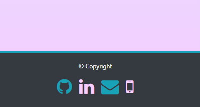

# Brianna's Portfolio
## 7/2/20

### Updated Contact Information
- Added icons in the footer for contact information

- Added an icon on the About page for my resume

### Updated Responsiveness
- Set more breakpoints for responsiveness on smaller screens on portfolio page

``` CSS
@media (max-width: 375px) {
    .child {
        margin-left: 0px;
        width: 313px;
    }
    .card {
        margin-left: auto;
        margin-right: auto;
        padding: 25px;
    }
}
@media (max-width: 320px) {
    .child {
        width: 258px;
    }
}
```

### Added New Projects to Portfolio Page
1. Weather Dashboard 
2. Coronavirus Stats
3. Code Quiz
4. Password Generator
5. Work Day Scheduler

### Updated Bio
- Edited the bio blurb on the About page


## Links

### [Portfolio Link](https://kairora.github.io/Bullock-Portfolio/index.html) 

### [Porfolio Repo](https://github.com/kairora/Bullock-Portfolio)
---

## 5/8/20
This assignment is the starting build of my own portfolio. It has three pages: About, Portfolio, and Contact.  There is a working navbar and links out to my projects so far either directly or via my github repositories. 

The images are responsive.


